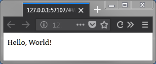

# mupf
Low-level browser DOM manipulation from Python

Mupf aims at tapping into great GUI potential of modern browsers for Python. It
is **not a web app framework**. It connects the Python side through a WebSocket
to the JavaScript of a local machine browser. Virtually any manipulation of DOM
is possible from that point without writing any JavaScript (however,
transferring the logic from Py to JS is encouraged as an app matures).
Potentially any web GUI framework (or none) can be used on the front-end side.

It is as easy as:

```Python
import mupf

with mupf.App().open_with_client() as client:
    client.window.document.body.innerHTML = "Hello, World!"
```


