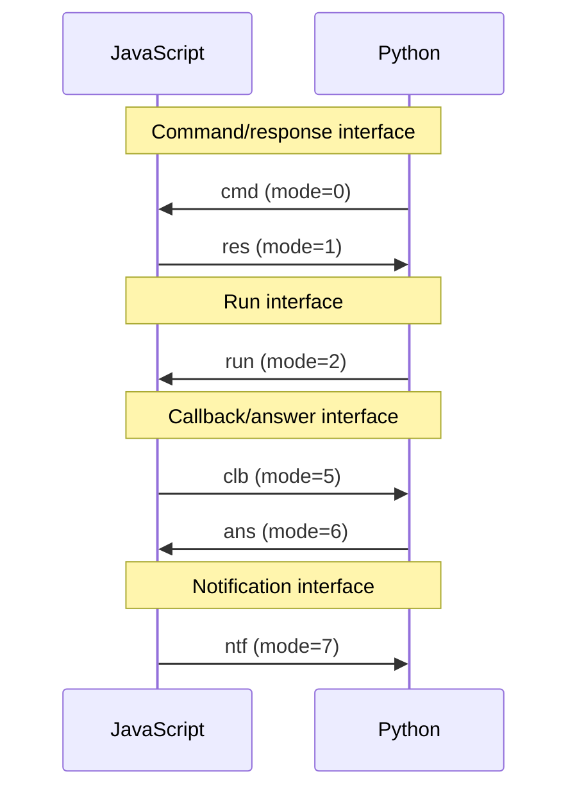

The CRRCAN protocol
===================

**What**: fixed format of JSONs exchanged between Py and JS.

**Why**: to carry metadata for command/callback API.

**How**:  very similarly how TCP/IP/HTTP stack work − metadata + payload.

The CRRCAN protocol is the way the JSONs sent between PY and JS sides are
formatted. Each JSON is always a four element list. First value of this list
describes a **mode** of this particular message. There are six **modes** and
CRRCAN is an acronym made of the first letters of their mnemonic names.

Modes "CRR" are analogous to "CAN" modes by the symmetry of PY/JS sides.
However, it should be noted that this symmetry is superficial and present only
on the CRRCAN protocol level, and the Py and JS sides **are not** symmetrical
in other respects.

## JSON fields

The format of a message is not supposed to change, hence it was fixed as an
`array` instead of more flexible `object`.

<pre><code class="javascript">[ mode, ccid, noun, payload ]

// example:
[ 0, 5, "*get*", ["~",{"args":[["~@",0],"body"],"kwargs":{}},{"c":1}] ]
</code></pre>

### The mode

There are six modes of a message. Each one has a three-letter mnemonic and
integer (**magic number**) value. The integers are sent in the JSON to shorten
the message representation. The `cmd` (command) and `clb` (callback) mode
messages should be at some point followed with `res` (response) and `ans`
(answer) messages respectively, sent in the opposite direction. The `res`
and `ans` carry a return value or error value (in the payload). The `run` and
`ntf` (notify) modes do not expect a response − that is their only difference
from `cmd` and `clb`.

<!-- ### The transaction id

The **trid** is an integer field holding an identification code of a transaction to which the message belongs to. The integer is equal to the **ccid**
of the `*trbegin*` command which started the transaction. Moreover, the `*first*` command also strarts a general transaction, hence all messages sent outside of explicit transactions have this field set to `0`.

Only messages belonging to the current transaction will be processed. All other ones will be stored until apropriate transaction become curent. -->

### The client command id

The **ccid** is a unique ascending identifier of a message with two caveats:

* messages pairs (`cmd`/`res` and `clb`/`ans`) share the same **ccid** − this is the main point of the **ccid**s
* uniqueness of the **ccid** is only "per side" − Python **ccid**s and JS **ccid**s will conflict

In other words, the pair `(mode, ccid)` is completely unique, and pair
`(bool(mode<5), ccid)` is unique for a given sender (Py or JS).

### The noun

The **noun** is a general name for two things:

* name of a command/callback function (modes `cmd`, `run`, `clb` and `ntf`) − a string
* status of function execution (modes `res` and `ans`) - an integer

Names of commands are the names of functions in `mupf.cmd` on the JS side. The
names of callbacks are ***WHAT?***

The status has value `0` or `1` denoting normal execution or erroneous
execution respectively. The details of an error are contained in the
**payload**.

### The payload

On the bootstrap-level the **payload** is an array with fields dependent on the
**mode**. However, core-level features can (and frequently do) modify its
content. In this document only bootstrap-level structure of the **payload** is
described. The modifications are described in **separate document**.
